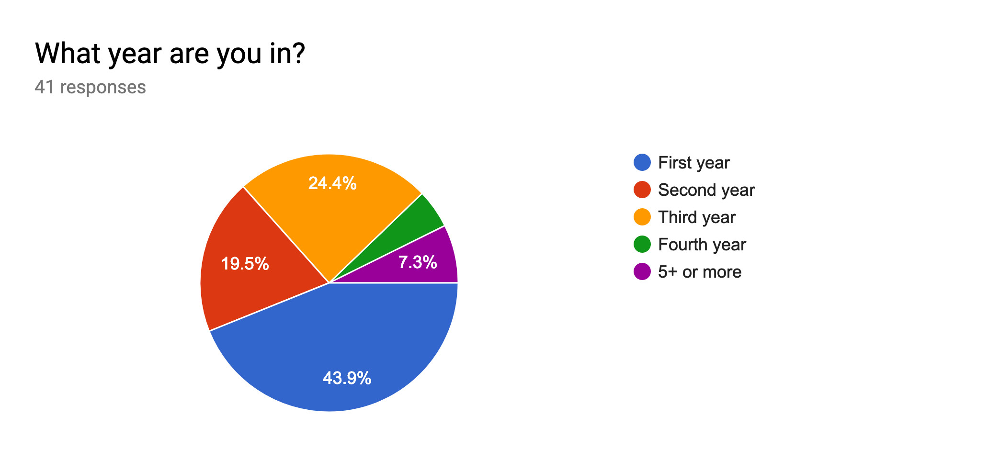
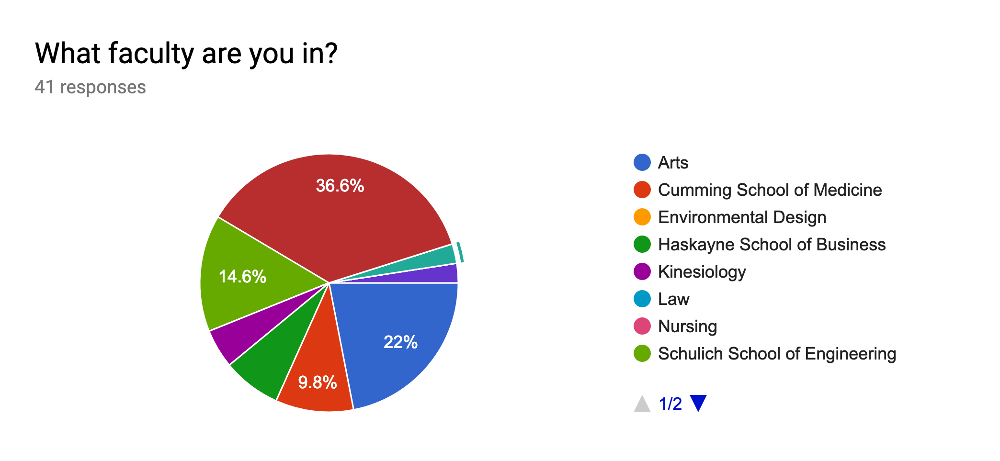
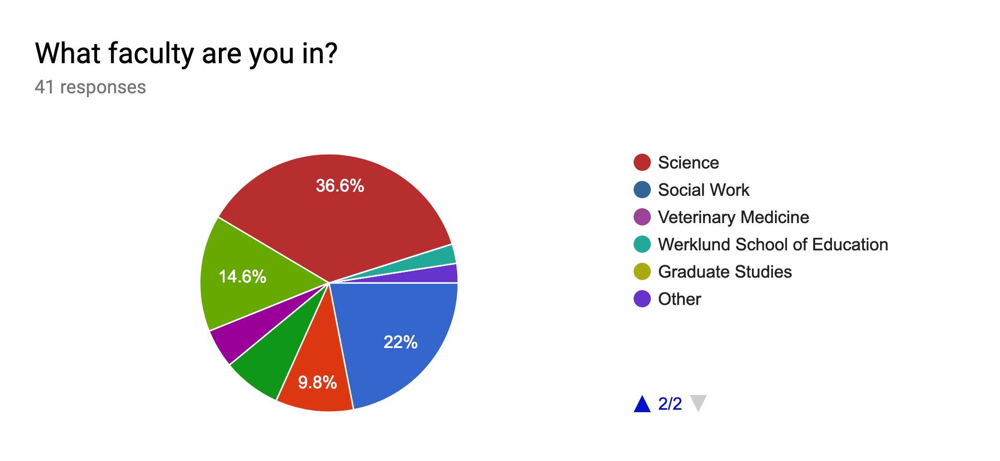
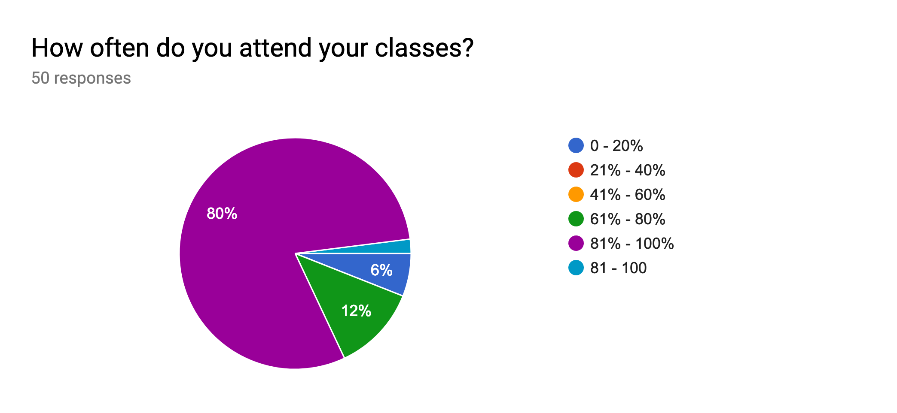
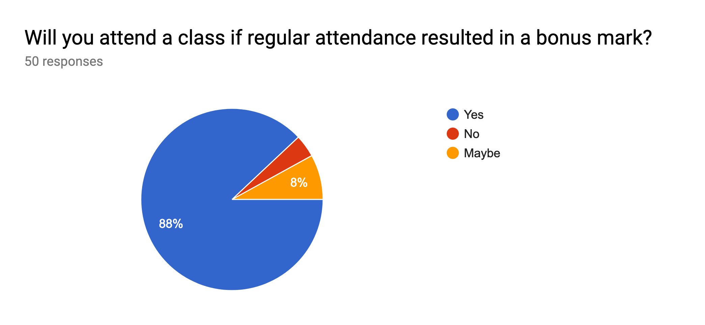
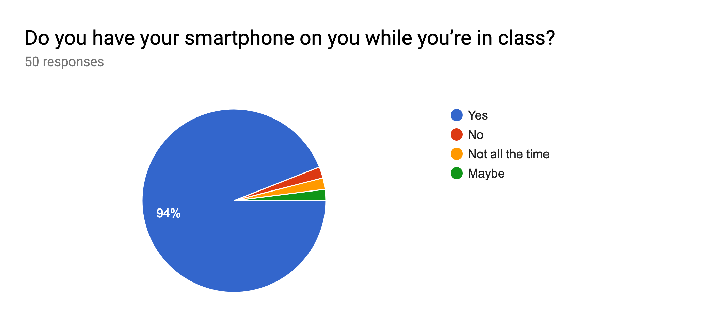
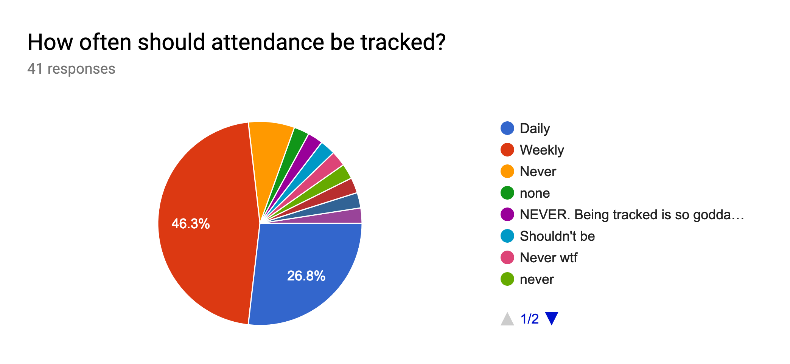
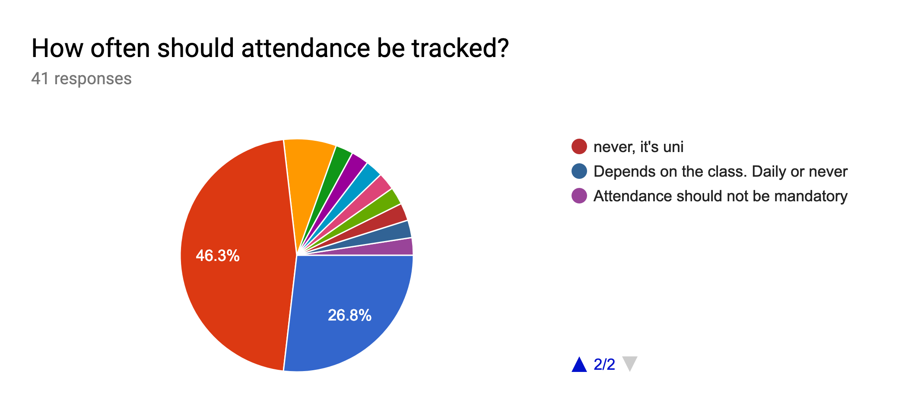

# QR Attendance Tracker

  
<b>Artem Golovin</b>: 30018900

  
<b>Victor Mendoza</b>: 30065807

  
<b>SeungBin Yim</b>: 30048699

  
<b>Kevin Ng</b>: 30029178

  
<b>Oliver Morrish</b>: 10134165

---

## Project idea

These days many students prefer using tablets, or even smartphones for note taking, while majority, if not every student have access to their own smartphone. Knowing that such portable devices are most popular among high school and college students, using built-in camera on a smartphone or a tablet can help with tracking students' attendance. A student will simply have to scan the presented QR code (or enter a unique lecture number) and the system will record that student as attending. Some professors do not release any notes in order to motivate students to come to lectures. This system can also help to those who attended lecture but wanted to review the lecture notes/slides. A teacher will be able to share documents with all attending students. Taking attendance can enhance the educational process. It also can verify student's identity to eliminate false registrations.

Other use cases of this project might be free events where a host would like to gather data or information about how many people actually attended vs. people who signed up for event. A person who hosts such event can analyze the data just like teacher can analyze the class attendance data

## Stakeholders

Our system is aimed to be primarily used by students and teachers. While they will be our direct users, they are also the stakeholders of our system. Other potential stakeholders may include event hosts and attendees for a particular meetup, who would use the system in similar fashion.

### Teacher (or Event Host)

Not all teachers are technically advanced, so the system should be as straightforward as possible and offer some support or help. A teacher may utilize the system to gather and analyze the attendance data as well as to provide additional resources to attending students. By tracking the attendance, teachers can get better understanding of effectiveness of the teaching material, e.g. if the attendance is too low, it might be the case that lectures are not interesting enough or teaching material is outdated (as it often the case with some computer science courses).

Oftentimes, event organizers would want to know how many people actually attended the event. For example, services like Meetup.com provide an easy way for people to create events. However it is not always clear how many people actually showed up to a particular event. With our system, event host can track the number of attending people.

### Student (or Attendee)

These days it is safe to say that almost every student owns a smartphone. Their familiarity and experiences with these devices will make the usage of our product more or less intuitive. However, QR codes may not be known to all students, learning how QR codes work is simple and along with the familiar use of smartphones, using the product will be effortless. A student may be also more inclined to attend class since teacher’s can assign bonus marks or give notes only to the students who attend the classes. The system would behave similarly for attendees.

### Developers (Us)

We will be required to add or adjust the software in accordance of the need of our users. We must have full understanding of how the software is used and are able to provide necessary help to users who request it.

## Research methods

To gain better knowledge of how the system should behave, we will conduct two research methods: **survey** and **secondary research**. The combination of both methods will give us better understanding of what our end users want from the final system and how it should behave.

### Survey

Our survey is designed primarily for students, because it is easier to ask a lot of students to fill out a survey and it will help us to gather necessary information for the project since they are one of the stakeholders of the project. It would be faster to conduct a survey rather than interviewing students, since we could gather information from more students.

### Secondary research

The system that we are designing has already been implemented in some different ways. Secondary research helps us identifying weak points in existing projects and building up from previous experiences.

Secondary research was centered around finding data about grade-school attendance rates and attempts to improve them. In North America, student absenteeism is often dealt with by the individual schools, making less traditional methods, like an application, more viable. In American schools, number for attendance suggest that class attendance is an issue for around 10% of all students. The impact that this has on grades worsens over time; higher grade levels show larger drops in school performance as students attend less classes. In addition, students who miss or skip classes in earlier grades will tend to have worse grades in later years. 

As for *increasing* attendance, one Philadelphia study found that providing a "nudge" could increase attendance rates for students over the previous year. By providing feedback on previous year attendance along with a message emphasizing the negative impacts of absenteeism, they found that student attendance rose by 2.4% overall. Interestingly, different forms of “nudge” did not seem to change these numbers between groups; the act of the “nudge” itself was enough to promote higher attendance. 

It seems clear that we should provide some form of feedback statistics, notifications, or both to the "student" users of our software in order to achieve a similar result.

When it comes to similar implementations, often there need to be set up two different systems that will interact with each other. One of the examples may include QR code scanning app and excel spreadsheet. A teacher (or event host) would have to manually set up a QR code for a class and enter attending students to an excel spreadsheet. In terms of usability and good user experience, this is not the best solution as it requires many different steps to set up attendance tracking system.

Resources that were used for secondary research:

1. ["Student QR Codes To Record Attendance"](https://www.jackrabbitclass.com/blog/use-student-qr-codes-to-record-attendance/)
2. ["QR Codes To Record Attendance"](https://blog.qrstuff.com/2017/11/15/qr-codes-for-attendance-tracking)
3. ["A National Portrait of Chronic Absenteeism in the Early Grades"](https://www.attendanceworks.org/wp-content/uploads/2017/09/A-National-Portrait-of-Chronic-Absenteeism-in-the-Early-Grades-Oct-2007.pdf)
4. ["A randomized experiment using absenteeism information to “nudge” attendance"](https://www.attendanceworks.org/wp-content/uploads/2017/09/Todd-postcard-Nudge-research-publis-REL_2017252.pdf)
5. ["How School Attendance Influences Student Success"](https://www.attendanceworks.org/wp-content/uploads/2017/05/Absenses-Add-Up_September-3rd-2014.pdf)
6. ["Attendance Tracking with QR Codes and Smartphones"](https://www.codereadr.com/blog/attendance-tracking-qr-codes-smartphones/)

## Reflection from Research Methods

### Survey

We reached out to University of Calgary students to see what can can they say regarding attendance. Our demographic includes students from different faculties however the most students indicated they are from Science. The majority of surveyed students are first year students.

We can see that 80% of surveyed students attend almost all classes. However, there are some students who do not attend all of their classes.

Majority of students would like to receive a bonus mark. Therefore, this feature will be important to students.

Since students have their smartphones on them while they are in class, we can see that our application will need to be easily accessible from a mobile device.

However, we discovered that students do not want the attendance to be mandatory. Instead they would prefer to get some bonus marks and access to extra study material.

So, having access to extra materials and receiving bonus marks would be more focused on the students and the attendance tracker portion would be more oriented to the teachers.

### Secondary research

Secondary research provided us with more knowledge about attendance rates and how class attendance can affect students’ future academic achievements. We found various implementations, but most of them are very simple and lack of features that we are planning to implement.

## Usage expectations

The system can be used in several different ways. While the target audience is teachers and students, some event hosts can benefit from using the system. Here are how we expect the system to be used:

1. Teachers, who require class attendance could motivate students for coming into class by giving bonus marks for attendance.
2. Attending students can also get access to slides or lecture material that would not normally be posted online.
3. Teachers can examine the attendance date and re-evaluate their teaching material based on that information.
4. Students don’t have to wait in long lines to sign up for their attendance. This provides ease of taking the attendance and eliminates any additional paperwork for teachers.
5. Event hosts can get the actual number of attendees which will help them to improve their events.
6. Students can have access to the statistics of their attendance.

