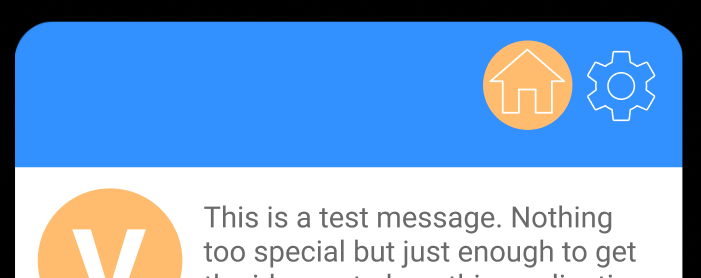

# Quick Pay - Heuristic Evaluation

  
<b>Artem Golovin</b>: 30018900

  
<b>Victor Mendoza</b>: 30065807

  
<b>SeungBin Yim</b>: 30048699

  
<b>Kevin Ng</b>: 30029178

  
<b>Oliver Morrish</b>: 10134165

---

### Visibility of system status

- There is no way to tell when the messages were sent or if it even sent/read. Like most messaging apps, there should be a way for the user to tell if their message was successfully transmitted and the time all messages were sent, and possibly add a read to know that the other user has successfully received the message.

  

- Home page is lacking a banner icon, unlike the wallet and setting pages. It is also somewhat unclear that this is the home page, since the "home" button is still present. Should be the same format as the settings page, perhaps with the home button removed altogether.

  

- It is unclear how user can delete a card from their wallet. By tapping on the card, user should see details about selected card and not an option to delete it.

  

### Match between system and the real world

- It is unclear if this is the name of the company the user is banking under or the name of the specific branch. Providing a dropdown menu of the possible selections would help if it is the former.

  

- ‘House’ icon for text messages doesn’t match as much as maybe a ‘Message’ icon with regard to the functions that the page does. Although, it is called the home page, a ‘Message’-like icon would be better with a ‘Messages’ title rather than ‘Home’. Also the ‘Dollar’ icon still feels ambiguous in a sense that it doesn’t match up with the _transfer_ of money. A possible fix can be changing it to a ‘Transfer’-like icon that includes the dollar sign (although the user is greeted with what these icons mean anyways, it should be more intuitive)

- The ‘Dollar’ icon still feels ambiguous in a sense that it doesn’t match up with the _transfer_ of money. A possible fix can be changing it to a ‘Transfer’-like icon that includes the dollar sign (although the user is greeted with what these icons mean anyways, it should be more intuitive)

### User control and freedom

- If the user accidentally clicks on the add bank card info, or if they added a few information and decided to not actually commit, there is no cancel or go back option. Same for the register account.

### Consistency and standards

- Card deletion is done via tapping on card, which is not the usual pattern. Instead, there needs to be an edit button that will allow users to delete items.

- No way of sending a message without having to open keyboard

  

- ‘Add’ in the settings page should have an icon. It looks like the action is adding a house

  

- Assuming the phone number field just displays a number and the login button implies entering a username/email and password, it would lead to a negative transfer effect since the user would try to enter something into this field. Also, it shouldn’t have a field as big as the ‘Login’ and ‘Register’ buttons if this were the case.

- Having wallet and bank information under settings seems counterintuitive, since payment features are the main draw of the app. Payment, bank, and wallet settings may be better served as their own tab, since to many users, "settings" is used as a fallback when they cannot find main features.

### Error prevention

- No good error prevention in case someone accidentally pressed delete card. A confirmation popup would be expected.

  

- User cannot close dialog that prompts to request or send money from/to another user

### Recognition rather than recall

- Users will have to wonder what plus sign button indicates or what it does. For better UX, it needs to have better icon.

### Flexibility and efficiency of use

- The ‘request’ function feels useless since a person can just explicitly say they want money for whatever reason and the other person can either send or not send.

### Aesthetic and minimalist design

- Text on the initial pages is appears slightly off-center, which might throw off some people. Text should be aligned.

  

- Letters are not centered vertically and horizontally

  

- Settings icon is redundant and not needed because the title says the location

  

- Having a back button in the Chat page rather the 'Home' button since the only way to access the chat is from the Home page anyways. It feels too cluttered with the Settings button

  

- Text messages display too much. Should be one - two lines maximum so that the display does not feel cluttered.

### Help users recognize, diagnose, and recover from errors

- Nothing is made for this. but understandable for just a simply hi-fidelity prototype, try to add one for when you create the actual version, for stuff like adding a bad card or poor registration.

- User should be able to cancel a request as well

### Help and documentation

- Not much help presented, unclear why user needs to enter a phone number

- Does a good job with bringing up a help thing for users when starting out, but there is no way to re-enter the dialogue if you want to see it again. Perhaps a question mark or other help icon on the main page could cause the dialogue to pop up again.

  

